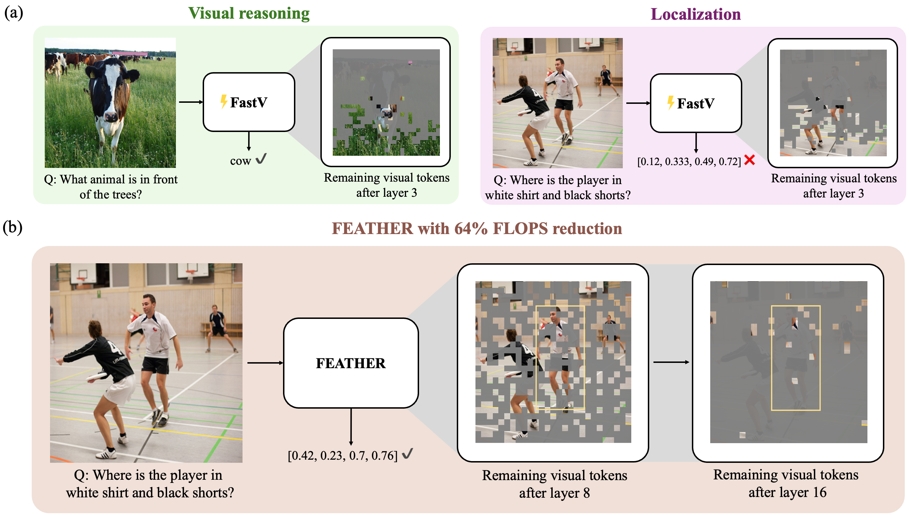

<p align="center">

  <h1 align="center">Feather the Throttle: Revisiting Visual Token Pruning for Vision-Language Model Acceleration
    <a href='https://arxiv.org/abs/2412.13180'>
    
    </a>
    <a href='https://web.stanford.edu/~markendo/projects/feather' style='padding-left: 0.5rem;'>
    
  </h1>
  <h3 align="center">
    <a href="https://web.stanford.edu/~markendo/"><strong>Mark Endo</strong></a>
    ,
    <a href="https://wxh1996.github.io/"><strong>Xiaohan Wang</strong></a>
    ,
    <a href="https://ai.stanford.edu/~syyeung/"><strong>Serena Yeung-Levy</strong></a>
  </h3>
  <h3 align="center">In International Conference on Computer Vision (ICCV) 2025</h3>
  <div align="center">
  </div>
</p>

<div>
  
</div>

Our repository is split into two sections, one for [model code](prismatic-vlms) and the other for [evaluation](vlm-evaluation).
## Setup


1. Clone the repository
```
git clone https://github.com/markendo/FEATHER
cd FEATHER
```

2. Install packages
```
conda create -n feather python=3.10 -y
conda activate feather
cd prismatic-vlms
pip install -e .
cd ../vlm-evaluation
pip install -e .
cd ..
```

3. Prepare data

The script for preparing evaluation datasets is at [`vlm-evaluation/scripts/datasets/prepare.py`](vlm-evaluation/scripts/datasets/prepare.py). More information about dataset preparation is available in the [original codebase](https://github.com/TRI-ML/vlm-evaluation). Lastly, copy your HuggingFace token to `vlm-evaluation/.hf_token`.


## Inference and Evaluation

We provide code for our experiments on evaluating various criteria for token pruning such as FastV, our modified version removing RoPE from the criteria, and our final FEATHER approach.

```
export DATASET_ROOT_DIR=/path/to/dataset/directory/
cd vlm-evaluation
bash scripts/eval_fastv.sh
bash scripts/eval_fastv_norope.sh
bash scripts/eval_feather.sh
```

Below are the results for RefCOCO and OCID-Ref.

| Criteria         | OCID-Ref | RefCOCOg | RefCOCO+ | RefCOCO |
| ---------------- | -------- | -------- | -------- | ------- |
| FastV            |  5.8     |   5.0    |    6.6   |   7.6   |
| FastV w/o RoPE   |  23.2    |   15.0   |   13.8   |  15.4   |
| FEATHER          |  32.5    |   38.7   |   38.7   |  43.4   |

The main implementation of FEATHER is provided in [`prismatic-vlms/prismatic/models/backbones/llm/llama2_models.py`](prismatic-vlms/prismatic/models/backbones/llm/llama2_models.py). Note that results can vary slightly based on attention implementation.


## Acknowledgments

This repository is built on top of the [prismatic-vlms](https://github.com/TRI-ML/prismatic-vlms) and [vlm-evaluation](https://github.com/TRI-ML/vlm-evaluation) codebases.

## Citation
```bib
@article{endo2025feather,
  author    = {Endo, Mark and Wang, Xiaohan and Yeung-Levy, Serena},
  title     = {Feather the Throttle: Revisiting Visual Token Pruning for Vision-Language Model Acceleration},
  journal   = {ICCV},
  year      = {2025},
}
```